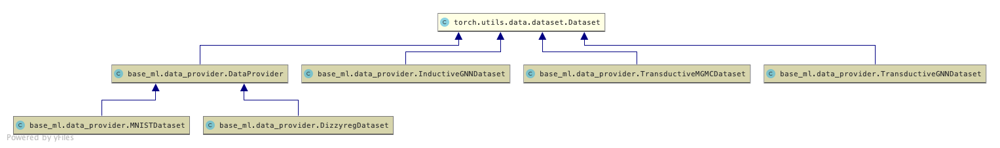
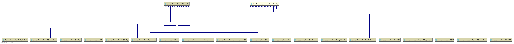
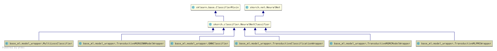
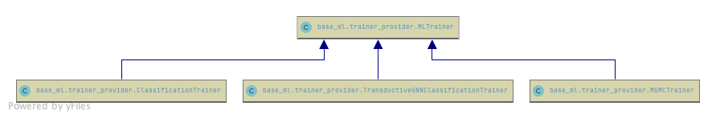

base-ml's documentation!
========================

.. toctree::
   :glob:
   :maxdepth: 1
   :caption: Notes:

   notes/*

base-ml's documentation!
========================
.. toctree::
   :glob:
   :maxdepth: 2
   :caption: Package Reference:

   references/*

Data
====

Model
=====

Trainer
=======

Indices and tables
==================

* :ref:`genindex`
* :ref:`modindex`
* :ref:`search`
